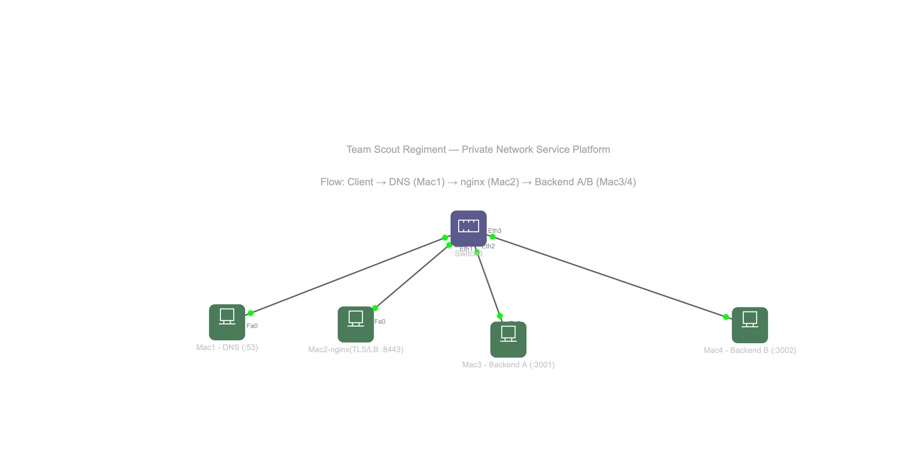

# Architecture — Private Network Service Platform (Team 1)

Phase 1: Build & Observe. Four macOS laptops on one private LAN, serving a
private domain over HTTPS through a reverse proxy and load balancer.

## 1. Topology

All four Macs are on the **same private Wi-Fi / LAN**. See the IP/service table
in `docs/network-inventory.md`.



Text version of the same topology:

```
                    Private Wi-Fi / LAN (same subnet)
   ┌──────────────┬──────────────────┬──────────────┬──────────────┐
   │              │                  │              │              │
┌──┴───┐      ┌───┴────┐         ┌────┴───┐      ┌───┴────┐
│ Mac 1 │      │ Mac 2  │         │ Mac 3  │      │ Mac 4  │
│ DNS + │      │ Edge   │         │Backend │      │Backend │
│Client │      │ nginx  │         │  A     │      │  B +   │
│dnsmasq│      │ TLS/LB │         │ :3001  │      │Client  │
│  :53  │      │:8443   │         │        │      │ :3002  │
└───────┘      └────────┘         └────────┘      └────────┘
 Rashmi        Samiksha          Shubhaang         Ankit
```

| Machine | Member    | Role                      | Service(s)          | Cloud equivalent          |
|---------|-----------|---------------------------|---------------------|---------------------------|
| Mac 1   | Rashmi    | Private DNS + Test Client | dnsmasq (:53/UDP)   | Managed DNS (Route 53)    |
| Mac 2   | Samiksha  | Edge / Reverse Proxy + LB | nginx, TLS (:8443)   | Cloud load balancer / CDN |
| Mac 3   | Shubhaang | Backend Server A          | Flask REST (:3001)  | App server instance A     |
| Mac 4   | Ankit     | Backend Server B + Client | Flask REST (:3002)  | App server instance B     |

## 2. Request flow (one `https://app.team1.test/api/status` request)

```
Client (Mac 1 / Mac 4)
   │ 1. DNS QUERY   ── UDP :53 ──►  Mac 1 (dnsmasq)   "app.team1.test = ?"
   │    DNS RESPONSE ◄──            "app.team1.test -> Mac 2 IP"
   │ 2. TCP HANDSHAKE ── TCP :8443 ─► Mac 2  SYN -> SYN-ACK -> ACK
   │ 3. TLS HANDSHAKE ──►  Mac 2   ClientHello -> ServerHello -> Certificate
   │                               -> Key Exchange -> Finished  (now encrypted)
   │ 4. HTTPS REQUEST ──►  Mac 2   GET /api/status
   ▼
Mac 2  nginx reverse proxy + round-robin load balancer
   ├── proxy_pass ──► Mac 3  Backend A :3001  (X-Backend: A)
   └── proxy_pass ──► Mac 4  Backend B :3002  (X-Backend: B)
   │ 6. HTTP RESPONSE (JSON + X-Backend + Cache-Control)
   ▼
Client receives the response over the encrypted TLS channel
```

| Step | Protocol         | OSI layer           | Port            |
|------|------------------|---------------------|-----------------|
| 1    | DNS              | Application         | 53/UDP          |
| 2    | TCP              | Transport           | 8443/TCP        |
| 3    | TLS              | Session / Transport | 8443/TCP        |
| 4/6  | HTTP/HTTPS       | Application         | 8443/TCP        |
| 5    | HTTP (to backend)| Application         | 3001 / 3002 TCP |
|  —   | IP / Ethernet    | Network / Link      | no ports (uses IP + MAC addresses) |

## 3. Key points

- **DNS is a directory, not a connection** — it only maps the name to Mac 2's IP;
  the TCP/TLS connection is a separate step.
- The **client never knows the backend IPs**; it only talks to the edge (Mac 2).
- After the TLS handshake the HTTP payload is **encrypted**, so Wireshark shows
  `Application Data`; use `curl -v` for the cleartext view.

> Ports note: if a Mac cannot bind 80/443, use 8080/8443 instead (no marks lost).
